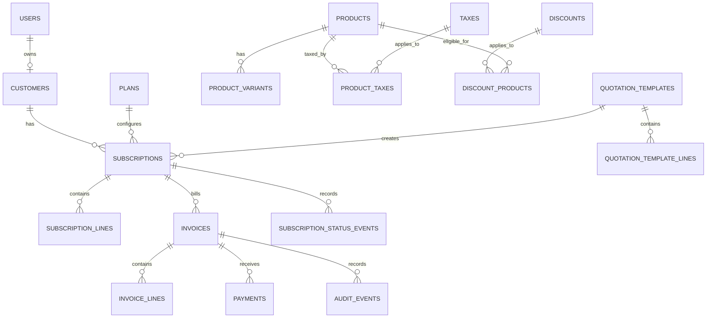

# Brightloop ER Model

```mermaid
erDiagram
  USERS ||--o| CUSTOMERS : owns
  CUSTOMERS ||--o{ SUBSCRIPTIONS : has
  PLANS ||--o{ SUBSCRIPTIONS : configures
  PRODUCTS ||--o{ PRODUCT_VARIANTS : has
  PRODUCTS ||--o{ PRODUCT_TAXES : taxed_by
  TAXES ||--o{ PRODUCT_TAXES : applies_to
  DISCOUNTS ||--o{ DISCOUNT_PRODUCTS : applies_to
  PRODUCTS ||--o{ DISCOUNT_PRODUCTS : eligible_for
  QUOTATION_TEMPLATES ||--o{ QUOTATION_TEMPLATE_LINES : contains
  QUOTATION_TEMPLATES ||--o{ SUBSCRIPTIONS : creates
  SUBSCRIPTIONS ||--o{ SUBSCRIPTION_LINES : contains
  SUBSCRIPTIONS ||--o{ INVOICES : bills
  INVOICES ||--o{ INVOICE_LINES : contains
  INVOICES ||--o{ PAYMENTS : receives
  SUBSCRIPTIONS ||--o{ SUBSCRIPTION_STATUS_EVENTS : records
  INVOICES ||--o{ AUDIT_EVENTS : records
```
